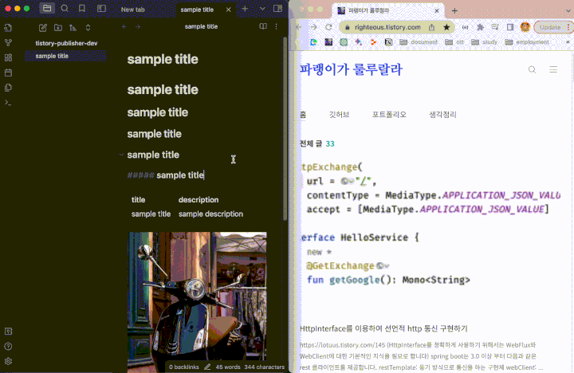
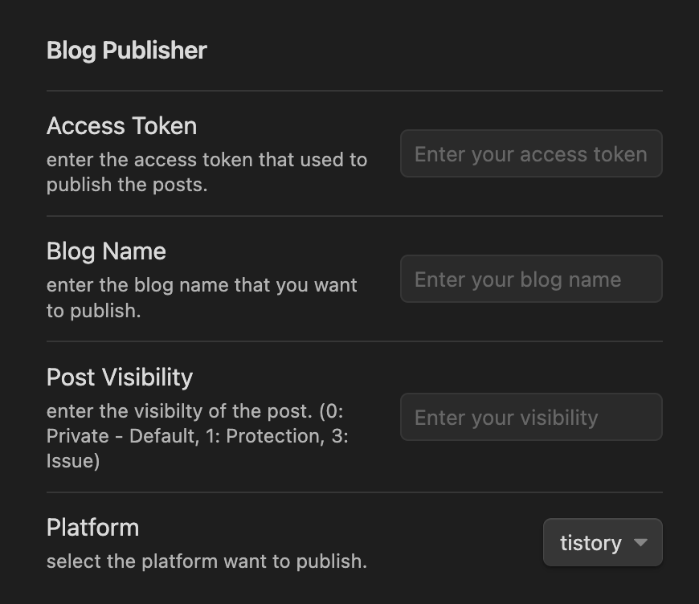

# Blog Publisher

The Blog Publisher plugin helps to publish obsidian notes to blog platform. You only need to go through 3 steps to publish your note. please check the demo tab below for detailed instructions.

### Demo

### How to use

1. settings default `access token`, `visibility`, ``blog name``, `platform`
   
2. select the note that want to publish
3. open command tab and enter `publish-post`

### Features

- use github actions automatically generate tags.
- create command that publish note to medium.
