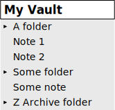
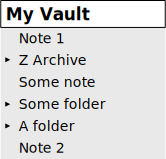
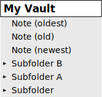
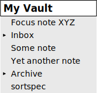
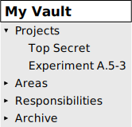
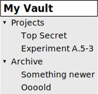
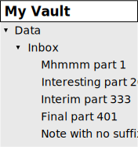

## Custom Sorting Order in File Explorer (https://obsidian.md plugin)

Take full control of the order of your notes and folders in File Explorer

- folder-level configuration
	- each folder can have its own order or use the global Obsidian setting
- use sorting and grouping rules or direct order specification or mixed
- versatile configuration options
- order configuration stored directly in your note(s) front matter
	- use a dedicated key in YAML

## TL;DR Usage

For full version of the manual go to [./docs/manual.md]() and [./docs/syntax-reference.md]()
> REMARK: as of this version of documentation, the manual and syntax reference are empty :-)

Below go examples of (some of) the key features, ready to copy & paste to your vault.

For simplicity (if you are examining the plugin for the first time) copy and paste the below YAML snippets to the front
matter of the `sortspec` note (which is `sortspec.md` file under the hood). Create such note at any location in your
vault if you don't have one.

Each time after creating or updating the sorting specification click the [ribbon icon](#ribbon_icon) to parse the
specification and actually apply the custom sorting in File Explorer

Click the [ribbon icon](#ribbon_icon) again to disable custom sorting and switch back to the standard Obsidian sorting.

The [ribbon icon](#ribbon_icon) acts also as the visual indicator of the current state of the plugin - see
the [ribbon icon](#ribbon_icon) section for details

### Simple case 1: in root folder sort items by a rule, intermixing folders and files

The specified rule is to sort items alphabetically

> IMPORTANT: indentation matters in all of the examples

```yaml
---
sorting-spec: |
    target-folder: /
    < a-z
---
```

which can result in:



### Simple case 2: impose manual order of some items in root folder

The specification here lists items (files and folders) by name in the desired order

Notice, that only a subset of items was listed. Unlisted items go after the specified ones, if the specification
doesn't say otherwise

```yaml
---
sorting-spec: |
    target-folder: /
    Note 1
    Z Archive
    Some note
    Some folder
---
```

produces:



### Example 3: In root folder, let files go first and folders get pushed to the bottom

Files go first, sorted by modification date descending (newest note in the top)

Then go folders, sorted in reverse alphabetical order

> IMPORTANT: Again, indentation matters in all of the examples. Notice that the order specification `< modified` for
> the `/:files` and the order `> a-z` for `/folders` are indented by one more space. The indentation says the order
> applies
> to the group and not to the 'target-folder' directly.
>
> And yes, each group can have a different order in the same parent folder

```yaml
---
sorting-spec: |
    target-folder: /
    /:files
     < modified
    /folders
     > a-z
---
```

will order items as:



### Example 4: In root folder, pin a focus note, then Inbox folder, and push archive to the bottom

The specification below says:

- first go items which name starts with 'Focus' (e.g. the notes to pin to the top)
	- notice the usage of '...' wildcard
- then goes an item named 'Inbox' (my Inbox folder)
- then go all items not matching any of the above or below rules/names/patterns
	- the special symbol `%` has that meaning
- then, second to the bottom goes the 'Archive' (a folder which doesn't need focus)
- and finally, in the very bottom, the `sortspec.md` file, which probably contains this sorting specification ;-)

```yaml
---
sorting-spec: |
    target-folder: .
    Focus...
    Inbox
    %
    Archive
    sortspec
---
```

and the result will be:



> Remarks for the `target-folder:`
>
> In this example the dot '.' symbol was used `target-folder: .` which means _apply the sorting specification to the
folder which contains the note with the specification_.
>
> If the `target-folder:` line is omitted, the specification will be applied to the parent folder of the note, which has
> the same effect as `target-folder: .`

### Example 5: P.A.R.A. method example

The P.A.R.A. system for organizing digital information is based on the four specifically named folders ordered as in the
acronym: Projects — Areas — Resources — Archives

To put folders in the desired order you can simply list them by name in the needed sequence:

```yaml
---
sorting-spec: |
    target-folder: /
    Projects
    Areas
    Responsibilities
    Archive
---
```

which will have the effect of:



### Example 6: P.A.R.A. example with smart syntax

Instead of listing full names of folders or notes, you can use the prefix or suffix of prefix+suffix notation with the
special syntax of '...' which acts as a wildcard here, matching any sequence of characters:

```yaml
---
sorting-spec: |
    target-folder: /
    Pro...
    A...s
    Res...es
    ...ive
---
```

It will give exactly the same order as in previous example:


```
REMARK: the wildcard expression '...' can be used only once per line
```

### Example 7: Apply the same sorting rules to two folders

Let's tell a few folders to sort their child notes and child folders by created date reverse order (newer go first)

```yaml
---
sorting-spec: |
    target-folder: Some subfolder
    target-folder: Archive
    target-folder: Archive/2021/Completed projects
    > created
---
```

No visualization for this example needed

### Example 8: Specify rules for multiple folders

The specification can contain rules and orders for more than one folder

Personally I find convenient to keep sorting specification of all folders in a vault in a single place, e.g. in a
dedicated note Inbox/Inbox.md

```yaml
---
sorting-spec: |
    target-folder: /
    Pro...
    Archive

    target-folder: Projects
    Top Secret

    target-folder: Archive
    > a-z
---
```

will have the effect of:



### Example 9: Sort by numerical suffix

This is interesting.

Sorting by numerical prefix is easy and doesn't require any additional plugin in Obsidian.
At the same time sorting by numerical suffix is not feasible without a plugin like this one.

Use the specification like below to order notes in 'Inbox' subfolder of 'Data' folder by the numerical suffix indicated
by the 'part' token (an arbitrary example)

```yaml
---
sorting-spec: |
    target-folder: Data/Inbox
    ... part \d+
     < a-z
---
```

the line `... part \d+` says: group all notes and folders with name ending with 'part' followed by a number. Then order
them by the number. And for clarity the subsequent (indented) line is added ` < a-z` which sets the order to
alphanumerical ascending.

The effect is:



## Location of sorting specification YAML entry

You can keep the custom sorting specifications in any of the following locations (or in all of them):

- in the front matter of the `sortspec` note (which is the `sortspec.md` file under the hood)
	- you can keep one global `sortspec` note or one `sortspec` in each folder for which you set up a custom sorting
	- YAML in front matter of all existing `sortspec` notes is scanned, so feel free to choose your preferred approach
- in the front matter of the - so called - _folder note_. For instance '/References/References.md'
	- the 'folder note' is a concept of note named exactly as its parent folder, e.g. `references` note (
	  actually `references.md` file) residing inside the `/references/` folder
	- there are popular Obsidian plugins which allow convenient access and editing of folder note, plus hiding it in the
	  notes list
- in the front matter of a **designated note** configured in setting
	- in settings page of the plugin in obsidian you can set the exact path to the designated note
	- by default, it is `Inbox/Inbox.md`
	- feel free to adjust it to your preferences
	- primary intention is to use this setting as the reminder note to yourself, to easily locate the note containing
	  sorting specifications for the vault

A sorting specification for a folder has to reside in a single YAML entry in one of the listed locations.
At the same time, you can put specifications for different target folders into different notes, according to your
preference.
My personal approach is to keep the sorting specification for all desired folders in a single note (
e.g. `Inbox/Inbox.md`). And for clarity, I keep the name of that designated note in the plugin settings, for easy
reference.

<a name="ribbon_icon"></a>

## Ribbon icon

Click the ribbon icon to toggle the plugin between enabled and suspended states.

States of the ribbon icon:

-  Plugin suspended. Custom sorting NOT applied.
	- Click to enable and apply custom sorting.
	- Note: parsing of the custom sorting specification happens after clicking the icon. If the specification contains
	  errors, they will show up in the notice baloon and also in developer console.
-  Plugin active, custom sorting applied.
	- Click to suspend and return to the standard Obsidian sorting in File Explorer.
-  Syntax error in custom sorting configuration.
	- Fix the problem in specification and click the ribbon icon to re-enable custom sorting.
	- If syntax error is not fixed, the notice baloon with show error details. Syntax error details are also visible in
	  the developer console
-  Plugin enabled but the custom sorting was not applied.
	- This can happen when reinstalling the plugin and in similar cases
	- Click the ribbon icon twice to re-enable the custom sorting.

## Installing the plugin

As for now, the plugin can be installed manually or via the BRAT plugin

### Installing the plugin using BRAT

1. Install the BRAT plugin
	1. Open `Settings` -> `Community Plugins`
	2. Disable restricted (formerly 'safe') mode, if enabled
	3. *Browse*, and search for "BRAT"
	4. Install the latest version of **Obsidian 42 - BRAT**
2. Open BRAT settings (`Settings` -> `Obsidian 42 - BRAT`)
	1. Scroll to the `Beta Plugin List` section
	2. `Add Beta Plugin`
	3. Specify this repository: `SebastianMC/obsidian-custom-sort`
3. Enable the `Custom File Explorer sorting` plugin (`Settings` -> `Community Plugins`)

### Manually installing the plugin

1. Go to Github for releases: https://github.com/SebastianMC/obsidian-custom-sort/releases
2. Download the Latest Release from the Releases section of the GitHub Repository
3. Copy the downloaded files `main.js`, `styles.css`, `manifest.json` over to your
   vault `VaultFolder/.obsidian/plugins/custom-sort/`.
	- you might need to manually create the `/custom-sort/` folder under `VaultFolder/.obsidian/plugins/`
4. Reload Obsidian
5. If prompted about Restricted (formerly 'Safe') Mode, you can disable restricted mode and enable the plugin.
   -Otherwise, go to `Settings` -> `Community plugins`, make sure restricted mode is off and enable the plugin from
   there.

> Note: The `.obsidian` folder may be hidden.
> On macOS, you should be able to press Command+Shift+Dot to show the folder in Finder.

## Credits

Thanks to [Nothingislost](https://github.com/nothingislost) for the monkey-patching ideas of File Explorer
in [obsidian-bartender](https://github.com/nothingislost/obsidian-bartender)

