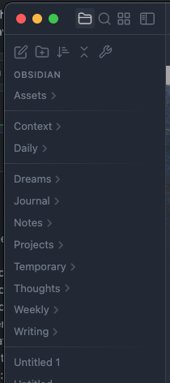

> This is a simple version of README which highlights the **basic scenario and most commonly used feature**
>
> The [long and much more detailed advanced-README.md is here](./docs/advanced-README.md)

---
## Freely arrange notes and folders in File Explorer (https://obsidian.md plugin)

Take full control of the order of your notes and folders:

- treat folders and files equally or distinctively, you decide
- fine-grained folder-level or even notes-group-level specification
- support for fully manual order
  - list notes and folders names explicitly, or use prefixes or suffixes only
  - wildcard names matching supported
- group and sort notes and folders by notes custom metadata
- support for automatic sorting by standard and non-standard rules
- mixing manual and automatic ordering also supported
- order by compound numbers in prefix, in suffix (e.g. date in suffix) or inbetween
- Roman numbers support, also compound Roman numbers
- grouping by prefix or suffix or prefix and suffix
  - different sorting rules per group even inside the same folder
- simple to use yet versatile configuration options
- order configuration stored directly in your note(s) front matter
  - use a dedicated `sorting-spec:` key in YAML
- folders not set up for the custom order remain on the standard Obsidian sorting
- support for imposing inheritance of order specifications with flexible exclusion and overriding logic

---
## Basic scenario 1: set the custom sorting order for a specific folder

Create a new note named `sortspec` in the folder for which you want to configure the sorting

In the top of the new note put the following YAML front matter text:

```yaml
---
sorting-spec: |
  order-desc: a-z
---
```

Click the ribbon button ( or  on phone) to tell the plugin to read the sorting specification and apply it.
The sorting should be applied to the folder. On desktops and tablets the ribbon icon should turn ()

!!! **Done!** !!!

You should see the files and sub-folders in your folder sorted in reverse alphabetical order, folders and files intermixed

An illustrative image which shows the reverse alphabetical order applied to the root folder of some vault:


---
### Remarks

> Remarks:
> - your new `sortspec` note should [look like this](./docs/examples/basic/sortspec.md?plain=1) except for the syntax highlighting, which could differ
> - you will notice that the folders and files are treated equally and thus intermixed
>   - the behavior depends on what files and subfolders you have in your folder
> - changing the sorting order via the standard Obsidian UI button won't affect your folder, unless...
>   - ...unless you deactivate the custom sorting via clicking the ribbon button to make it ()
> - for clarity: the underlying file of the note `sortspec` is obviously `sortspec.md`
> - in case of troubles refer to the [TL;DR section of advanced README.md](./docs/advanced-README.md#tldr-usage)
> - feel free to experiment! The plugin works in a non-destructive fashion, and it doesn't modify the content of your vault.
>   It only changes the order in which the files and folders are displayed in File Explorer
> - indentation matters in YAML -> the two leading spaces in `  order-desc: a-z` are intentional and required
> - this common example only touches the surface of the rich capabilities of this custom sorting plugin. For more details go to [advanced version of README.md](./docs/advanced-README.md)

---
## Basic scenario 2: explicitly list folders and files in the order which you want

This comes from the suggestion by [TheOneLight](https://github.com/TheOneLight) in [this discussion](https://github.com/SebastianMC/obsidian-custom-sort/discussions/95#discussioncomment-7048584)

Take the instructions from the **[Basic scenario 1](https://github.com/SebastianMC/obsidian-custom-sort#basic-scenario-set-the-custom-sorting-order-for-a-specific-folder)** above and replace the YAML content with:

```yaml
---
sorting-spec: |
  My first folder name
  My second folder name
  My first file name
  My second file name
  // ... and continue so in the desired order
---
```

This will enforce the order as you listed inside the YAML

---
## Editing multi-line properties in the new YAML properties editor (Obsidian 1.4 and newer)

The newly introduced YAML properties editor (Obsidian 1.4 and newer) can make editing the multi-line text properties tricky and confusing.
There are short videos here [How to create or edit a multi‐line property in Obsidian?](https://github.com/SebastianMC/obsidian-custom-sort/wiki/How-to-create-or-edit-a-multi%E2%80%90line-property-in-Obsidian%3F) which could be helpful:
- how to edit the multi-line text properties in Obsidian properties editor (`shift+enter` does the magic here)
- how to edit the multi-line text properties in Obsidian `source view mode` (the classic way, as you did prior to Obsidian 1.4)

---
## Basic automatic sorting methods

The list of basic automatic sorting orders includes:
- `  order-asc: a-z` - **alphabetical order**, aka natural
  - 'a' goes before 'z' and numbers are treated specifically and 2 goes before 11
- `  order-desc: a-z` - **reverse alphabetical order**, aka reverse natural, aka descending alphabetical
  - 'z' goes before 'a' and numbers are treated specifically and 11 goes before 2
- `  order-asc: true a-z` - **true alphabetical order**
  - 'a' goes before 'z' and numbers are treated as texts and 11 goes before 2
- `  order-desc: true a-z` - **true reverse alphabetical order**, aka descending true alphabetical
  - 'z' goes before 'a' and numbers are treated as texts and 11 goes before 2
- `  order-asc: created` - **by creation date**
  - the oldest notes go first. Sub-folders pushed to the top, alphabetically
- `  order-desc: created` - **by creation date, descending**
  - the newest notes go first. Sub-folders pushed to the bottom, alphabetically
- `  order-asc: advanced created` - **by creation date, also for folders**
  - the oldest notes and sub-folders go first
  - for sub-folders the creation date of the oldest contained note is taken as folder's creation date
  - sub-folders not containing any notes are pushed to the top, alphabetically
- `  order-desc: advanced created` - **by creation date, descending, also for folders**
  - the newest notes and sub-folders go first
  - for sub-folders the creation date of the newest contained note is taken as folder's creation date
  - sub-folders not containing any notes are pushed to the bottom, alphabetically
- `  order-asc: modified` - **by modification date**
  - the most dusty notes go first. Sub-folders pushed to the top, alphabetically
- `  order-desc: modified` - **by modification date, descending**
  - the most recently modified notes go first. Sub-folders pushed to the bottom, alphabetically
- `  order-asc: advanced modified` - **by modification date, also for folders**
  - the most dusty notes and sub-folders go first
  - for sub-folders the modification date of the most dusty contained note is taken as folder's modification date
  - sub-folders not containing any notes are pushed to the top, alphabetically
- `  order-desc: advanced modified` - **by modification date, descending, also for folders**
  - the most recently modified notes and sub-folders go first
  - for sub-folders the modification date of the most recently modified contained note is taken as folder's modification date
  - sub-folders not containing any notes are pushed to the bottom, alphabetically

> Remark:
> In the above list the `-asc` stems from `Ascending` and `-desc` stems from `Descending`

## Manual sorting

The **manual ordering of notes and folders** is also done via the sorting configuration.
Refer to the [TL;DR section of advanced README.md](./docs/advanced-README.md#tldr-usage) for examples and instructions

## Ribbon icon

Click the ribbon icon to toggle the plugin between enabled and suspended states.

States of the ribbon icon on large-screen devices (desktops, laptops and tablets like iPad):

-  Plugin suspended. Custom sorting NOT applied.
-  Plugin active, custom sorting applied.
-  Syntax error in custom sorting configuration.
-  Plugin suspended. General error.
-  Plugin enabled, but the custom sorting was not applied.
-  (Only on large-screen mobile devices like iPad). 
  Plugin enabled. but the custom sorting was not applied.

On small-screen mobile devices (phones) the icon is static:

-  The icon acts as a button to toggle between enabled and disabled. Its appearance doesn't change

For more details on the icon states refer to [Ribbon icon section of the advanced-README.md](./docs/advanced-README.md#ribbon-icon)

## Small screen mobile devices remarks

- you might need to activate the custom sorting on your mobile separately, even if on a shared vault the custom sorting was activated on desktop
- the Obsidian command palette being easily available (swipe down gesture on small-screen mobiles) allows for quick steering of the plugin via commands: sort-on and sort-off.
This could be easier than navigating to and expanding the ribbon 
- the ribbon icon is static () and doesn't reflect the state of custom sorting.
You can enable the _plugin state changes_ notifications in settings, for the mobile devices only

## Installing the plugin

### From the official Obsidian Community Plugins page

The plugin could and should be installed from the official Obsidian Community Plugins list at https://obsidian.md/plugins
or directly in the Obsidian app itself.
Search the plugin by its name 'CUSTOM FILE EXPLORER SORTING'

> For other installation methods refer to [Installing the plugin section of advanced-README.md](./docs/advanced-README.md#installing-the-plugin)

## Credits

Thanks to [Nothingislost](https://github.com/nothingislost) for the monkey-patching ideas of File Explorer
in [obsidian-bartender](https://github.com/nothingislost/obsidian-bartender)

## ...and before you go, maybe you'd like the visual separators in File Explorer?

Do you want to have a nice-looking horizontal separators in File Explorer like this?



If so, head on to [Instruction and more context](https://github.com/SebastianMC/obsidian-custom-sort/discussions/57#discussioncomment-4983763)
by [@replete](https://github.com/replete)\
Quick & easy!

This feature is not dependent on the Custom Sorting plugin.
At the same time I'm mentioning it here because it is a side effect of a discussion with [@replete](https://github.com/replete).
We were considering a direct support of the Separators in the plugin. Eventually this boiled down to a very
concise and smart CSS-snippet based solution, independent of the plugin. Go, see, copy to the CSS-snippets in Obsidian
and enjoy the more grouped look
