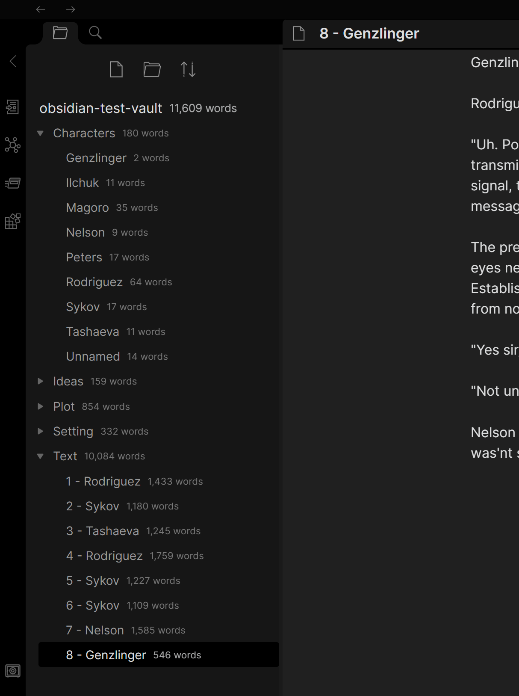

## Novel word count plugin

This plugin displays a word or page count next to every file, folder, and vault in the File Explorer pane. It updates as you write.

If you make changes to your files outside of Obsidian, you can trigger a recount of all files from the Command Palette (type "recount") or the plugin settings.

### Safety

This plugin treats your vault as read-only. It never modifies, deletes, or renames any file or folder. It uses cached reads of all files for performance reasons.

Obsidian's API does not provide contractual access to the File Explorer pane, so this plugin uses duck typing to find it. This is technically undocumented, so future updates of Obsidian may break functionality. If and when that happens, this plugin is designed to fail gracefully. Any cached word counts will still appear in the File Explorer but they won't update when you write; you may wish to disable the plugin until it can be updated.

This plugin's effect on the File Explorer DOM is extremely minimal. It adds a `[data-novel-word-count-plugin]` attribute to each node (vault, folder, or file), then defines CSS `::after` pseudo-elements that display the contents of the attribute. The existing elements are not modified in any other way and the structure is not changed.

### Development

- Clone this repo.
- `npm i` or `yarn` to install dependencies
- `npm run dev` to start compilation in watch mode.

### Manually installing the plugin

- Copy over `main.js`, `styles.css`, `manifest.json` to your vault `VaultFolder/.obsidian/plugins/novel-word-count/`.