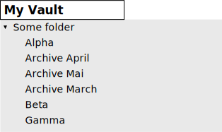
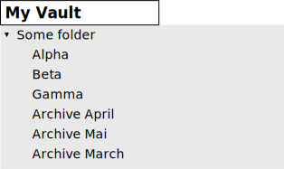

> Document is partial, creation in progress
> Please refer to [README.md](../README.md) and [advanced-README.md](../advanced-README.md) for more usage examples
> Check also [syntax-reference.md](./syntax-reference.md)

---
Some sections added ad-hoc, to be integrated later

# Hints, tips & tricks

## Adding visual separators in File Explorer

by @replete

[Instruction and more context](https://github.com/SebastianMC/obsidian-custom-sort/discussions/57#discussioncomment-4983763)


# Advanced features

## Priorities of sorting groups

At run-time, when the custom sorting is triggered (explicitly or automatically) each folder item (a file or a sub-folder) is evaluated against the sorting groups.
The evaluation (matching) is done in the order in which the sorting groups are defined in `sorting-spec: |` for the folder.

That means, for example, that the sorting group `/:files ...` will match _all_ files - in turn, none of files has a chance to match further rule

Consider the below example:
```yaml
---
sorting-spec: |
  target-folder: Some folder
       // The below sorting group captures (matches) all files
  /:files ...
       // The below sorting group should (theoretically) capture files with names starting with 'Archive' word
       //   yet none of files will have a chance to reach the rule, because the previous sorting group will match all files
       //   Hence, the below sorting group is void
  /:files Archive...
---
```

The resulting order of notes would be:



However, a group can be assigned a higher priority in the sorting spec. In result, folder items will be matched against them _before_ any other rules. To impose a priority on a group use the prefix `/!` or `/!!` or `/!!!`

The modified example would be:
```yaml
---
sorting-spec: |
  target-folder: Some folder
       // The below sorting group captures (matches) all files
  /:files ...
       // The below sorting group captures files with names starting with 'Archive' word
       //   and thanks to the priority indicator prefix '/!' folder items are matched against it
       //   before matching the previous sorting group
  /! /:files Archive...
---
```

and it would result in the expected order of items:



For clarity: the three available prefixes `/!` and `/!!` and `/!!!` allow for futher finetuning of sorting groups matching order, the `/!!!` representing the highest priority value

> A SIDE NOTE
> 
> In the above simplistic example, correct grouping of items can also be achieved in a different way:
> instead of using priorities, the first sorting group could be expressed differently as `/:files` (no following `...` wildcard):
> ```yaml
> ---
> sorting-spec: |
>   target-folder: Some folder
>   /:files
>   /:files Archive...
> ---
> ```
> The sorting group expressed as `/:files` alone acts as a sorting group 'catch-all-files, which don't match any other sorting rule for the folder' 

## Simple wildcards

Currently, the below simple wildcard syntax is supported for sorting group:

### A single digit (exactly one)

An expression like `\d` or `\[0-9]` matches a single digit (exactly one)

**Example 1**:

A group specification of `/:files Section \d\d`\
matches notes with names `Section 23` or `Section 01`, yet not a note like `Section 5`

An opposite example:

A group specification of `/:files Section \d`\
matches the note with name `Section 5` and doesn't match notes `Section 23` or `Section 01`

However, be careful if used in connection with a wildcard `...` - the behavior could be surprising:

A group specification of `/:files Section \d...`\
matches all notes like `Section 5`, `Section 23` or `Section 015`

**Example 2**:

As described above, the `\d` is equivalent to `\[0-9]` and can be used interchangeably\
A group specification of `/folders Notes of \[0-9]\[0-9]\[0-9]\[0-9]`\
matches the notes with titles like `Notes of 2022` or `Notes of 1999`

## Combining sorting groups

A prefix of `/+` used in sorting group specification tells the sorting engine
to combine the group with adjanced groups also prefixed with `/+`

**Example:**

The below sorting spec:
```yaml
---
sorting-spec: |
  Notes \d\d\d\d
   > advanced modified
  Notes \d\d\d\d-\d\d
   > advanced modified
---
```
defines two sorting groups:
- first go the notes or folders with title like `Notes 2022` or `Notes 1999`
- then go notes or folders like `Notes 2022-12` or `Notes 1999-11`

Both groups sorted by recent modification date, the newest go first\
Implicitly, all other files or folders go below these two groups

Using the `/+` prefix you can combine the two groups into a logical one:
```yaml
---
sorting-spec: |
  /+ Notes \d\d\d\d
  /+ Notes \d\d\d\d-\d\d
   > advanced modified
---
```
the result is that:
- notes or folders with title like `Notes 2022` or `Notes 1999`
- **AND**
- notes or folders like `Notes 2022-12` or `Notes 1999-11`

will be pushed to the top in File Explorer, sorted by most recent modification date

> NOTE: the sorting order is specified only once after the last of combined groups
> and it applies to the whole superset of items of all combined groups

### An edge case: two adjacent combined sorting groups

If you want to define two combined groups one after another
you should add a separator line with some artificial value not matching
any of your folders or files. The text `---+---` was used in the below example:

```yaml
---
sorting-spec: |
  /+ Zeta
  /+ % Gamma
  /+ /:files Beta
  /+ Alpha
    < a-z
  ---+--- 
  /+ Notes \d\d\d\d
  /+ Notes \d\d\d\d-\d\d
    > advanced modified
---
```

The artificial separator `---+---` defines a sorting group, which will not match any folders or files
and is used here to logically separate the series of combined groups into to logical sets

## Matching starred items

The Obsidian core plugin `Starred` allows the user to 'star' files\
The keyword `starred:` allows matching such items. A folder is considered _starred_ if at least one immediate child file is starred

**Example**

Consider the below sorting spec:
```yaml
---
sorting-spec: |
  //       Example sorting configuration showing
    //     how to push the starred items to the top
    //
    // the line below applies the sorting specification
    //  to all folders in the vault
  target-folder: /*
    // the sorting order specification for the target folder(s)
  > advanced created 
    // the first group of items captures the files and folders which
    // are 'starred' in Obsidian core 'Starred' plugin.
    // Items in this group inherit the sorting order of target folder
  starred:
    // No further groups specified, which means all other items follow the
    // starred items, also in the order specified
---
```

The above sorting specification pushes the _starred_ items to the top
To achieve the opposite effect and push the starred items to the bottom, use the below sorting spec:

```yaml
---
sorting-spec: |
  //       Example sorting configuration showing
    //     how to push the starred items to the bottom
    //
    // the line below applies the sorting specification
    //  to all folders in the vault
  target-folder: /*
    // the sorting order specification for the target folder(s)
  > a-z
    // the first group of items captures all of the files and folders which don't match any other sorting rule
    // Items in this group inherit the sorting order of target folder
  /folders:files
    // the second group of items captures the files and folders which
    // are 'starred' in Obsidian core 'Starred' plugin.
    // Items in this group also inherit the sorting order of target folder
  starred:
---
```

> **ADDITIONAL INFO**
> 
> Because of UX concerns and additional performance considerations, the order of items in File Explorer  
> is not updated automatically after starring or un-starring an item. Please click-click the ribbon
> icon or use the `sort-on` command to refresh and re-apply the sorting rules 

For a broader view, the same effect (as in previous example) can be achieved using the priorities
of sorting rules:

```yaml
---
sorting-spec: |
  //       Example sorting configuration showing
    //     how to push the starred items to the bottom
    //
    // the line below applies the sorting specification
    //  to all folders in the vault
  target-folder: /*
    // the sorting order specification for the target folder(s)
  > a-z
    // the first group of items captures all of the files and folders
    // Items in this group inherit the sorting order of target folder
  ...
    // the second group of items captures the files and folders which
    // are 'starred' in Obsidian core 'Starred' plugin.
    // Items in this group also inherit the sorting order of target folder
    // The priority '/!' indicator tells to evaluate this sorting rule before other rules
    // If it were not used, the prevoius rule '...' would eat all of the folders and items
    // and the starred items wouldn't be pushed to the bottom
  /! starred:
---
```

## Options for target-folder: matching

The `target-folder:` has the following variants, listed in the order of precedence:

1. match by the **exact folder path** (the default)
2. match by the **exact folder name**
3. match by **regexp** (for experts, be careful!)
4. match by **wildcard suffix** (aka match folders subtree)

If a folder in the vault matches more than one `target-folder:` definitions,
the above list shows the precedence, e.g. 1. has precedence over 2., 3. and 4. for example.
In other words, match by exact folder path always wins, then goes the match by folder exact name,
and so on.

If a folder in the vault matches more than one `target-folder:` definitions of the same type,
see the detailed description below for the behavior

### By folder path (the default)

If no additional modifiers follow the `target-folder:`, the remaining part of the line
is treated as an exact folder path (leading and trailing spaces are ignored,
infix spaces are treated literally as part of the folder path)

Within the same vault duplicate definitions of same path in `target-folder:` are detected
and error is raised in that case, indicating the duplicated path

Examples of `target-folder:` with match by the exact folder path:

- `target-folder: My Folder`
  - this refers to the folder in the root of the vault and only to it
- `target-folder: Archive/My Folder`
  - matches the `My Folder` sub-folder in the `Archive` folder (a sub-folder of the root)
- `target-folder: .`
  - this refers to path of the folder where the sorting specification resides (the specification containing the line,
    keep in mind that the sorting specification can reside in multiple locations in multiple notes) 
- `target-folder: ./Some Subfolder`
  - this refers to path of a sub-folder of the folder where the sorting specification resides (the specification containing the line,
    keep in mind that the sorting specification can reside in multiple locations in multiple notes)

### By folder name

The modifier `name:` tells the `target-folder:` to match the folder name and not the full folder path

This is an exact match of the full folder name, no partial matching

Within the same vault duplicate definitions of same name in `target-folder: name:` are detected
and error is raised in that case, indicating the duplicated folder name in sorting specification

Examples of `target-folder:` with match by the exact folder name:

- `target-folder: name: My Folder`
  - matches all the folders with the name `My Folder` regardless of their location within the vault

### By regexp (expert feature)

> WARNING!!! This is an EXPERT FEATURE.
> 
> Involving and constructing the regexp-s requires at least basic knowledge about the potential pitfalls.\
> If you introduce a heavy _regexp-backtracking_ it can **kill performance of Obsidian and even make it unresponsive**\
> If you don't know what the _regexp-backtracking_ is, be careful when using regexp for `target-folder:`

The modifier `regexp:` tells the `target-folder:` to involve the specified regular expressions in matching

Additional dependent modifiers are supported for `regexp:`:
- `for-name:`
  - tells the matching to be done against the folder name, not the full path
- `debug:`
  - tells the regexp to report its match in the developer console, so that you can easily investigate
    why the regexp matches (or why it doesn't match) as expected 
- `/!:` `/!!:` `/!!!:`
  - sets the priority of the regexp

By default, the regexp is matched against the full path of the folder, unless the `for-name:` modifiers tells otherwise.

By default, the regexp-es have no priority and are evaluated in the order of their definition.\
If you store `sorting-spec:` configurations in notes spread all over the vault,
consider the order of `target-folder: regexp:` to be undefined and - if needed - use
explicit priority modifiers (`/!:` `/!!:` `/!!!:`) to impose the desired order of matching.
  - a regexp with modifier `/!!!:` if evaluated before all other regexps, regardless of where they are configured
    - if two or more regexps are stamped with `/!!!:`, they are matched in the order in which they were defined.\
      Within a single YAML section of a note the order is obvious.\
      For sorting specifications spread over many notes in the vault consider the order to be undefined.
  - a regexp with modifier `/!!:` if evaluated after any `/!!!:` and before all other regexps
    - the same logic as described above applies when multiple regexps have the `/!!:` stamp
  - a regexp with modifier `/!:` indicates the lowest of explicitly defined priorities.\
    Such a regexp is matched after all priority-stamped regexps, before the regexps not having 
    any explicit priority stamp  

The escape character is \ - the standard one in regexp world.

Examples of `target-folder:` with match by regexp:

- `target-folder: regexp: reading`
  - matches any folder which contains the word `reading` in its path or name
- `target-folder: regexp: \d?\d-\d?\d-\d\d\d\d$`
  - matches any folder which ends with date-alike numerical expression, e.g.:
    - `1-1-2023`
    - `Archive/Monthly/12/05-12-2022`
    - `Inbox/Not digested notes from 20-7-2019`
- `target-folder: regexp: for-name: I am everywhere`
  - matches all folders which contain the phrase `I am everywhere` in their name, e.g.:
    - `Reports/Not processed/What the I am everywhere report from Paul means?`
    - `Chapters/I am everywhere`
- `target-folder: regexp: for-name: ^I am (everyw)?here$`
  - matches all folders with name exactly `I am everywhere` or `I am here` 
- `target-folder: regexp: for-name: debug: ^...$`
  - matches all folders with name comprising exactly 3 character
  - when a folder is matched, a diagnostic line is written to the console - `debug:` modifiers enables the logging
- `target-folder: regexp: debug: ^.{13,15}$`
  - matches all folders with path length between 13 and 15 characters
  - diagnostic line is written to the console due to `debug:`
- `target-folder: regexp: for-name: /!: ^[aA]`
  - matches all folders with name starting with `a` or `A`
  - the priority `/!:` modifier causes the matching to be done before all other regexps
    which don't have any priority 
- `target-folder: regexp: /!!!: debug: for-name: abc|def|ghi`
  - matches all folders with name containing the sequence `abc` or `def` or `ghi`
  - the modifier `/!!!:` imposes the highest priority of regexp matching
  - `debug:` tells to report each matching folder in the console
- `target-folder: regexp: ^[^/]+/[^/]+$`
  - matches all folders which are at the 2nd level of vault tree, e.g.:
    - `Inbox/Priority input`
    - `Archive/2021`
- `target-folder: regexp: ^[^\/]+(\/[^\/]+){2}$`
  - matches all folders which are at the 3rd level of vault tree, e.g.:
  - `Archive/2019/05`
  - `Aaaa/Bbbb/Test test`

### By wildcard

In the default usage of `target-folder:` with the exact full folder path, if the path contains
the `/...` or `/*` suffix its meaning is extended to:
- match the folder and all its immediate (child) subfolders - `/...` suffix
- match the folder and all its subfolders at any level (all descendants, the entire subtree) - `/*` suffix

For example:

- `target-folder: /*`
  - matches all folders in the vault (the root folder and all its descendants)
- `target-folder: /...`
  - matches the root folder and its immediate children (aka immediate subfolders of the root)

If the sorting specification contains duplicate wildcard-ed path in `target-folder:`
an error is raised, indicating the duplicate path

If a folder is matched by two (or more) wildcarded paths, the one with more path segments
(the deeper one) wins. For example:
- a folder `Book/Chapters/12/a` is matched by:
  - (a) `target-folder: Book/*`, and
  - (b) `target-folder: Book/Chapters/*`
  - In this case the (b) wins, because it contains a deeper path

If the depth of matches specification is the same, the `/...` takes precedence over `/*`
- a folder `Book/Appendix/III` is matched by:
  - (a) `target-folder: Book/Appendix/...`, and
  - (b) `target-folder: Book/Appendix/*`
  - In this case the (a) wins

## Excluding folders from custom sorting

Having the ability to wildard- and regexp-based match of `target-folder:` in some cases
you might want to exclude folder(s) from custom sorting.

This can be done by combination of the `target-folder:` (in any of its variants)
and specification of the sort order as `sorting: standard`

An example piece of YAML frontmatter could look like:

```yaml
---
sorting-spec: |

  // ... some sorting specification above
 
  target-folder: Reviews/Attachments
  target-folder: TODOs
  sorting: standard
 
  // ... some sorting specification below 
  
---
```
