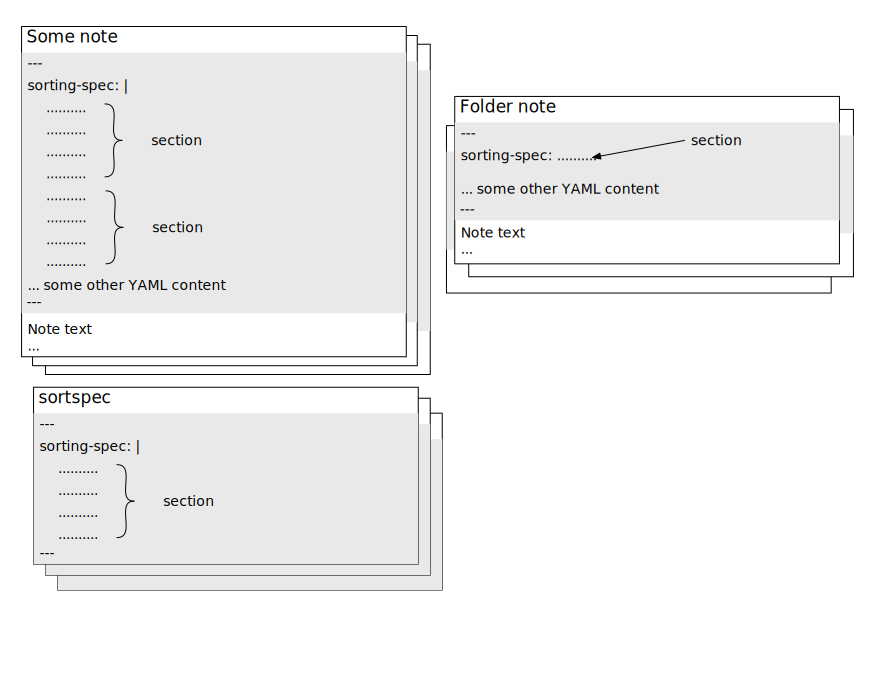

> Document is partial, creation in progress
> Please refer to [README.md](../../README.md) for usage examples
> Check [manual.md](), maybe that file has already some content?

# Table of contents

TBD

# Introduction

The syntax of sorting specification presented here intentionally uses an informal language (instead of a formal grammar definition).
The intention is to make it understandable to non-technical persons.

# The syntax



## Sorting specification

- the `sorting specification` has textual format
  - typically it is a multiline text 
  - at the same time, in the simplest case, a single line specification is also possible
- it has to be placed inside the frontmatter YAML in one or more Obsidian notes of the vault
  - the YAML key `sorting-spec:` has to be used
  - because indentation matters, the recommended multiline YAML syntax is `sorting-spec: |`
    - refer to YAML syntax reference for details on how the pipe `|` character works (e.g. https://en.wikipedia.org/wiki/YAML#Basic_components)
- the `sorting specification` comprises one or more [sections](#Section)
  - each `section` has to reside in a single location (a single entry in frontmatter YAML of a note)
  - multiple `sections` can exist under a single `sorting-spec: |` YAML entry, one after another
  - the following Obsidian notes are scanned for `sorting-spec:` YAML entries:
    - `sortspec` notes (that is `sortspec.md` files actually) in all folders of the vault, including the root folder
    - the so called `folder notes` - by convention these are notes named exactly the same as their parent folder, e.g. `Inbox/Inbox.md`
      - this works regardless if any 'Folder note' plugin is installed or not in the vault
    - the single designated note, as configured in plugin settings
  - all found `sections` in all above locations comprise the `sorting specification` for the vault
    - the order doesn't matter
    - it is a matter of personal preference whether to put all `sections` in a single YAML entry in a single note in the vault or if spread the specification over frontmatter of many notes
      - the Obsidian standard text search for `sorting-spec:` is convenient enough to list all specification entries in the vault
- empty lines inside the `sorting-spec: |` multiline value are ignored. They don't carry any semantic information
  - specifically: the empty lines _DON'T_ indicate a new `section`

## Section

- a `section` specifies sorting for one or more folders of the vault
- a `section` starts with one or more [target-folder:](#target-folder) lines, each one specifying a folder or a folders (sub)tree
  - the `target-folder:` is optional for the very first `section` in a `sorting-spec:` YAML entry. 
    In that case it is assumed that the target folder is the parent folder of the note containing the `sorting-spec:`
  - if a `target-folder:` is specified, the above default behavior is not applicable.
  - subsequent lines with `target-folder:` are collected and treated as multi-target-folder specification
    - empty lines are ignored
    - [comments](#Comments) are ignored as well
  - one (or more) `target-folder:` lines has to be followed by [sorting instruction(s)](#sorting-instructions) for these folders
    - the `sorting instruction(s)` can be ignored only for the last (or only) `target-folder:` line of `sorting-spec:`. 
      In that case, the default alphabetical sorting is assumed for the specified folders, treating the folders and notes equally
  - occurrence of `target-folder:` line after one or more `sorting-instruction(s)` indicates a beginning of a new `section`

---
- a [section](#Section) specifies sorting for one or more folders of the vault
- a [section](#Section) starts with one or more [target-folder:](#target-folder) lines, each one specifying a folder or a folders (sub)tree
	- the [target-folder:](#target-folder) is optional for the very first [section](#Section) in a `sorting-spec:` YAML entry.
	  In that case it is assumed that the [target-folder:](#target-folder) is the parent folder of the note containing the `sorting-spec:`
	- if a [target-folder:](#target-folder) is specified, the above default behavior is not applicable.
	- subsequent lines with [target-folder:](#target-folder) are collected and treated as multi-target-folder specification
		- empty lines are ignored
		- [comments](#Comments) are ignored as well
	- one (or more) [target-folder:](#target-folder) lines has to be followed by [sorting instruction(s)](#sorting-instructions) for these folders
		- the `sorting instruction(s)` can be ignored only for the last (or only) [target-folder:](#target-folder) line of `sorting-spec:`.
		  In that case, the default alphabetical sorting is assumed for the specified folders, treating the folders and notes equally
	- occurrence of [target-folder:](#target-folder) line after one or more `sorting-instruction(s)` indicates a beginning of a new [section](#Section)


## target-folder:

TBD

## Sorting instruction(s)

## Comments

Lines starting with `//` are ignored
> **NOTE:**
> 
> Depending on what indentation was used in the very first line of `sorting-spec: |`, it must be preserved also on comment lines.
  For example:
  ```yaml
  sorting-spec: |
    target-folder: /
    target-folder: Archive
    // This is some comment
	     // This is also a valid comment
    > modified
  // This is not a valid comment -> indentation is smaller than of the very first line of sorting-spec:    
  ```


### Supported sorting methods

#### At folder level only

- `sorting: standard` - gives back the control on order of items in hands of standard Obsidian mechanisms (UI driven).
 Typical (and intended) use: exclude a folder (or folders subtree) from a custom sorting resulting from wilcard-based target folder rule 

#### At folder and group level

- `< a-z` - alphabetical
- `> a-z` - alphabetical reverse, aka alphabetical descending, 'z' goes before 'a'
- `< modified` - by modified time, the long untouched item goes first (modified time of folder is assumed the beginning of the world, so folders go first and alphabetical)
- `> modified` - by modified time reverse, the most recently modified item goes first (modified time of folder is assumed the beginning of the world, so folders land in the bottom and alphabetical)
- `< created` - by created time, the oldest item goes first (modified time of folder is assumed the beginning of the world, so folders go first and alphabetical) 
- `> created` - by created time reverse, the newest item goes first (modified time of folder is assumed the beginning of the world, so folders land in the bottom and alphabetical)
- `< advanced modified` - by modified time, the long untouched item goes first. For folders, their modification date is derived from the most recently modified direct child file.
 For extremely large vaults use with caution, as the sorting needs to scan all files inside a folder to determine the folder's modified date
- `> advanced modified` - by modified time reverse, the most recently modified item goes first. For folders, their modification date is derived from the most recently modified direct child file.
 For extremely large vaults use with caution, as the sorting needs to scan all files inside a folder to determine the folder's modified date
- `< advanced created` - by created time, the oldest item goes first. For folders, their creation date is derived from the oldest direct child file.
 For extremely large vaults use with caution, as the sorting needs to scan all files inside a folder to determine the folder's created date
- `> advanced created` - by created time reverse, the newest item goes first. For folders, their creation date is derived from the newest direct child file.
 For extremely large vaults use with caution, as the sorting needs to scan all files inside a folder to determine the folder's created date

#### At group level only (aka secondary sorting rule)

> Only applicable in edge cases based on numerical symbols, when the regex-based match is equal for more than one item
 and need to apply a secondary order on same matches.

- `< a-z, created`
- `> a-z, created`
- `< a-z, created desc`
- `> a-z, created desc`
- `< a-z, modified`
- `> a-z, modified`
- `< a-z, modified desc`
- `> a-z, modified desc`
- `< a-z, advanced created`
- `> a-z, advanced created`
- `< a-z, advanced created desc`
- `> a-z, advanced created desc`
- `< a-z, advanced created`
- `> a-z, advanced created`
- `< a-z, advanced created desc`
- `> a-z, advanced created desc`

### Alternate tokens

Some tokens have shorter equivalents, which can be used interchangeably:

- `target-folder:` --> `::::` e.g `target-folder: /` is equivalent to `:::: /`
- `order-asc:` --> `<` e.g. `order-asc: modified` is equivalent to `< modified`
- `order-desc:` --> `>` e.g. `order-desc: a-z` is equivalent to `> a-z`
- `/:files` --> `/:` e.g. `/:files Chapter \.d+ ...` is equivalent to `/: Chapter \.d+ ...`
- `/:files.` --> `/:.` e.g. `/:files. ... \-D+.md` is equivalent to `/:. ... \-D+.md`
- `/folders` --> `/` e.g. `/folders Archive...` is equivalent to `/ Archive...`

Additional shorter equivalents to allow single-liners like `sorting-spec: \< a-z`:
- `order-asc:` --> `\<` e.g. `order-asc: modified` is equivalent to `\< modified`
- `order-desc:` --> `\>` e.g. `order-desc: a-z` is equivalent to `\> a-z`
